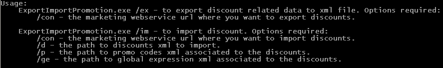

ExportImportPromotion
=====================

**Export and import promotions from Commerce Server 2007, 2009, 2009R2 and 10+.**

This solution builds two command line executables, one for versions of Commerce Server shipped by Microsoft and the other for post Microsoft versions of Commerce Server.

Usage:

## Important

This code was decompiled using ILSpy and then modified and placed here.  I have done this as the original tool is useful, but does not support later versions of Commerce Server.  The original version is no longer online, it [was here](http://archive.msdn.microsoft.com/ExportImportDiscount) and I have been unable to trace the author.  I only know he had the username **ccbeloy**.

I believe it unlikely that he would be against the updating of the tool.  However, I know this is a bit of a liberty, so if you know the author or have any concerns, please let me know.
